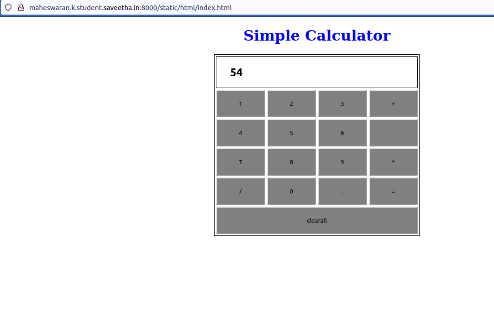

# Design a website to perform standard calculator in server side.

## AIM:
To design a website to perform standard calculator in server side.

## DESIGN STEPS:

### Step 1:

First Clone the repository to your theaid.

### Step 2:

Create a new folder named static inside the repository.

### Step 3:

Also create a project inside the repository and fill the needs.

### Step 4:

create a html folder inside statis folder and create a new file named index.html inside html folder.

### Step 5:

write your own code inside the index.html to create the calculator on website.

### Step 6:

Publish the website in the given URL.
## PROGRAM :
```
<!DOCTYPE html>
<html>
    <head>
        <title>SEC Demo on Calculator</title>
        <style type="text/css">
        table{
            border: 1px solid black;
            margin-left: auto;
            margin-right: auto;
        }
        input[type="text"]{
            border: 1px solid black;
            padding: 20px 30px;
            font-size: 24px;
            font-weight: bold;
            border-radius: 2px;
        }


        input[type="button"]{
            width: 100%;
            padding: 20px 40px;
            background-color:greenyellow;
            border-radius: 2px;
        }
        </style>
    </head>
    <body>
        <form name="form1" onload="result.value=''">
            <h1 style="text-align: center;color:blue;">Simple Calculator</h1>
        <table id="calc">
            <tr>
                <td colspan="4">
                    <input type="text" id="result">
                </td>
            </tr>
            <tr>
                <td><input type="button" value="1" onclick="result.value+='1'"/></td>
                <td><input type="button" value="2" onclick="result.value+='2'"/></td>
                <td><input type="button" value="3" onclick="result.value+='3'"/></td>
                <td><input type="button" value="+" onclick="result.value+='+'"/></td>
            </tr>
            <tr>
                <td><input type="button" value="4" onclick="result.value+='4'"/></td>
                <td><input type="button" value="5" onclick="result.value+='5'"/></td>
                <td><input type="button" value="6" onclick="result.value+='6'"/></td>
                <td><input type="button" value="-" onclick="result.value+='-'"/></td>
            </tr>
            <tr>
                <td><input type="button" value="7" onclick="result.value+='7'"/></td>
                <td><input type="button" value="8" onclick="result.value+='8'"/></td>
                <td><input type="button" value="9" onclick="result.value+='9'"/></td>
                <td><input type="button" value="" onclick="result.value+=''"/></td>
            </tr>
            <tr>
                <td><input type="button" value="/" onclick="result.value+='/'"/></td>
                <td><input type="button" value="0" onclick="result.value+='0'"/></td>
                <td><input type="button" value="." onclick="result.value+='.'"/></td>
                <td><input type="button" value="=" onclick="result.value=eval(result.value)"/></td>
            </tr>
            <tr>
                <td colspan="4">
                    <input type="button" value="clearall" id="clear" onclick="result.value=''">
                </td>
            </tr>
        </table>
        </form>
    </body>
</html>
```

## OUTPUT:

### Home Page of Calculator:




## Result:

A website to perform standard calculator in server side is designed and performed correctly.

